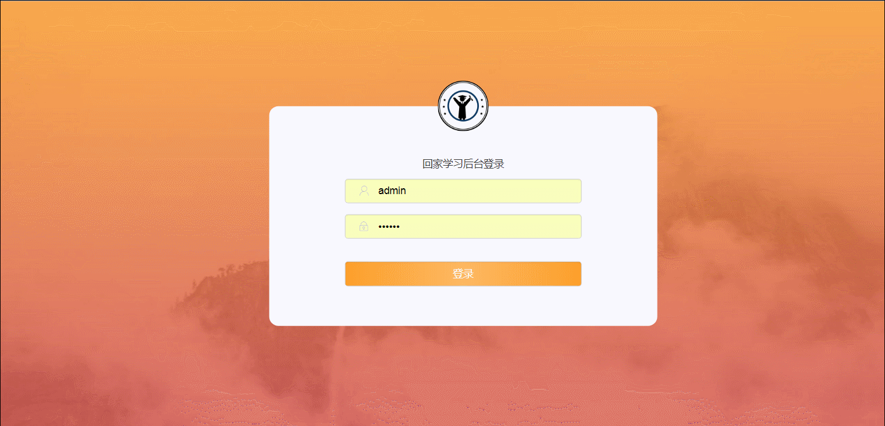

此demo为本人和几位小伙伴一起制作，利用现成的UI和需求所写，只相当于一个中等装修，不可直接食用，仅供参考。

demo大概分为教育一类，主要针对小学生进行课外辅导。流程图如下。

此项目分为前台和后台2个部分，前台展示平台默认为微信公众号，集成了微信支付系统，只可在微信内部打开，测试模式仅有1分钱，可供玩耍。

前台课程部分以及课程下的所有部分均为本人所写，其余部分为小伙伴所写

相对应的，后台教学管理和同步预习管理模块为本人所写,接口为后端小伙伴所写，restful风格

不保证本项目接口一直可用，近期可能关闭

  
前台需要手机号或者微信登陆，后台账密admin 123456

  
前台入口：<a href='http://118.31.21.185/JStasklist/project/playLearn-html/trunk/ojbk'>link</a>

 
后台入口:<a href='http://118.31.21.185/JStasklist/project/playLearn-admin-html/trunk/ojbk'>link</a>

  

  
